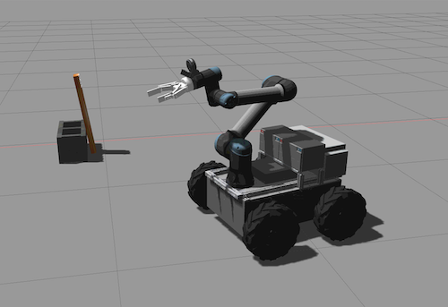
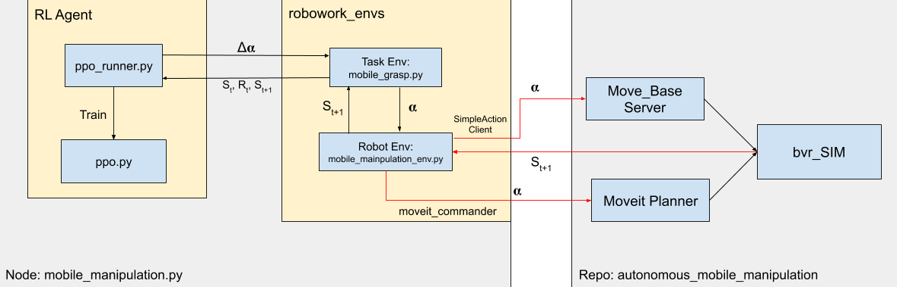

# ROS Gym Mobile Manipulation

Ros Gym Mobile Manipulation is an [OpenAI-ROS](https://bitbucket.org/theconstructcore/openai_ros/src/kinetic-devel/)
Gym environment for the Robowork Lab's [mobile manipulation](https://github.com/robowork/autonomous_mobile_manipulation) 
simulation and robot. The mobile manipulation simulation consists of a mobile base with an UR5 arm + 2-fingered Robotiq 
grip mounted on top of the base, shown below.



OpenAI ROS provides an extension to the OpenAI Gym for the Gazebo Simulator. Specifically, it provides an interface 
to interact with the GazeboSim and ROS, allowing robotic simulations in Gazebo and ROS to support the Gym Environment API.
The Mobile Manipulation Gym environment in this repository interfaces with the Robowork simulation through ROS, using 
the [MoveIt!](https://moveit.ros.org/) and [move_base](http://wiki.ros.org/move_base) libraries. 

## Implementation
The high-level architecture of the repository is shown below. The `mobile_manipulation.py` file is executed as a ROS node.
It begins the RL training loop, in `ppo_runner.py`, which implements the Proximal Policy Optimization RL training algorithm.
`ppo_runner.py` instantiates the "MobileGrasp-v0" Gym environment as well as the policy agent, implemented in 
`ppo.py`, and runs the RL training loops. The "MobileGrasp-v0" env, in the "robowork_envs" python package, contain a robot 
environment and a task environment. The robot environment, `mobile_manipulator_env.py`, encapsulates all the interaction 
with ROS to publish actions and collect state information. The task environment, `mobile_grasp.py`, implements the 
task-specific environment logic such as reward computation and observation construction. 

 

`ppo.py` implements the Proximal Policy Optimization algorithm. The Actor/Agent and the Critic models are implemented as 
a dense deep neural network. The agent predicts the mean of a multivariate Gaussian distribution, the dimensions of the 
action space; the resulting distribution is sampled to select an action set for the agent.
The PPO implementation was motivated by [this](https://github.com/wisnunugroho21/reinforcement_learning_ppo_rnd) repository.
All of the training and environment configurations are defined in `config/mobile_manipulation_params.yaml`. 

### Robowork Environment
The objective of the environment is to move the base close enough to the target object, the timber board, so that the end-effector
can reach it with some distance and orientation tolerance.
The `mobile_manipulator_env.py` uses MoveIt! to control the manipulator, by specifying a goal configuration for the end-effector.
It uses the `move_base` ROS package to control the mobile base, by specifying a goal configuration for the base. The state space
is constructed from various sources: `bvr_SIM_odom_message_to_tf/pose` topic, `joint_states` topic, and the MoveIt! library.
The state and action space is defined as follows: 

* State Space: base state (x, y, yaw), end-effector state (x, y, z, roll, pitch, yaw), arm joint state angles (6) 
and velocities (6), position of the goal object w.r.t the end-effector (x, y, z) and the base (x, y, z). 
    * numpy array of shape (27,)

* Action Space: base position deltas (x, y, yaw) and end-effector deltas (x, y, z, roll, pitch, yaw)
    * numpy array of shape (9,)

## Installation
`ros-gym-mobile-manipulation` was implemented on Ubuntu 18, ROS Melodic, and Python 2.7.

### Prerequisite
Follow the installation instructions for [mobile manipulation](https://github.com/robowork/autonomous_mobile_manipulation)
workspace. Make sure that you can run the simulation and test planning tasks shown in the instructions.

### Dependencies
* CUDA 10.1 and NVInfer6 (needs CUDA 10.2):
```
sudo add-apt-repository ppa:graphics-drivers/ppa
sudo apt-key adv --fetch-keys http://developer.download.nvidia.com/compute/cuda/repos/ubuntu1804/x86_64/7fa2af80.pub
echo "deb https://developer.download.nvidia.com/compute/cuda/repos/ubuntu1804/x86_64 /" | sudo tee /etc/apt/sources.list.d/cuda.list
echo "deb http://developer.download.nvidia.com/compute/machine-learning/repos/ubuntu1804/x86_64 /" | sudo tee /etc/apt/sources.list.d/cuda_learn.list
sudo apt-get update

sudo apt install cuda-10-1
sudo apt install cuda-10-2 libnvinfer6 libnvinfer-plugin6
```
* Upgrade pip2:
```
sudo -H pip2 install --upgrade pip
```
* Install Python 2.7 packages:
```
pip2 install numpy==1.16 scipy==1.2.2 gym==0.16 pyassimp==4.1.4
```
* Downgrade pyglet to 1.4:
```
pip2 uninstall pyglet && pip2 install pyglet==1.4
```
* Install Tensorflow 2.1.0 (latest that still supported Python 2.7) and tensorflow-probability:
```
pip2 install tensorflow==2.1.0
pip2 install tensorflow-probability==0.9.0
```
* Install gast (to resolve annoying warning from TF):
```
pip2 install gast==0.2.2
```
    
### Setup
* Clone this [openai-ros](https://github.com/robowork/openai-ros) repository
    * Not using original version because the above repository is closer to the OpenAI Gym implementation structure and contains a few bug fixes.
    * The can be found in [this bitbucket repository](https://bitbucket.org/theconstructcore/openai_ros/src/kinetic-devel/)
```
cd autonomous_mobile_manipulation_ws/src
git clone https://github.com/robowork/openai-ros
git clone https://github.com/robowork/ros-gym-mobile-manipulation

# Copy training files
cp ros-gym-mobile-manipulation/temp/bvr_sandbox.world autonomous_mobile_manipulation/robowork_gazebo/worlds
cp ros-gym-mobile-manipulation/temp/bvr_SIM_sandbox.launch autonomous_mobile_manipulation/robowork_gazebo/launch

# Rebuild
catkin build

# Create some paths
mkdir -p /home/$USER/mobile_manipulator_w
```

## Running training
```
# Launch the simulation
roslaunch robowork_gazebo bvr_SIM_sandbox.launch

# Launch MoveIt move_group node
ROS_NAMESPACE="bvr_SIM" roslaunch robowork_moveit_config robowork_moveit_planning_execution.launch robot_namespace:=bvr_SIM arm_namespace:=main_arm_SIM sim_suffix:=_SIM

# Launch RL node
ROS_NAMESPACE="bvr_SIM" roslaunch ros_gym_mobile_manipulation main.launch
```

### Loading model weights
To load saved weights, set the `load_weights` parameter to `True` and `save_model_path` to the correct path to the directory containing
the saved model weights. To evaluate the model without training, set `is_training` to `False`.

### Visualizing the reward
The episode run information is published on the topic `/mobile_grasp_rl_data`. The message is in JSON format and includes
the episode number, the total reward received in the episode, and the number of steps taken in the episode.

Run data can be saved using rosbag or wrapping the Environment with the Monitor Gym wrapper. Tensorboard integration for 
reward visualization is in progress. 
 
 
   
